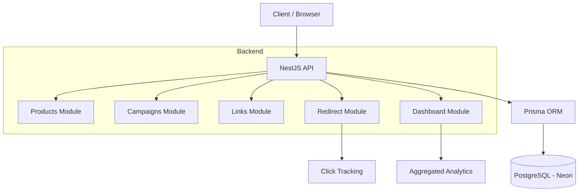
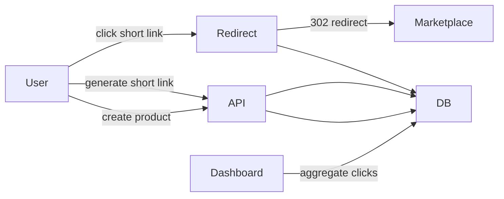
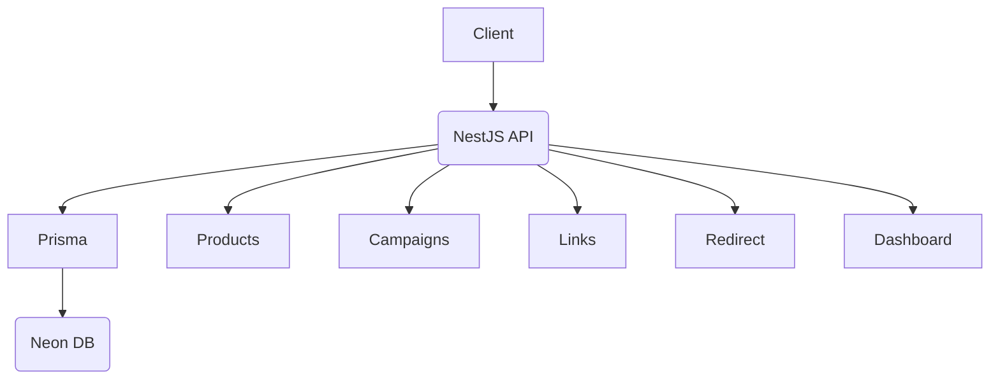

# 🚀 Affiliate Product Comparison API

A minimal backend system for comparing product prices across marketplaces (Shopee, Lazada) with affiliate link tracking and analytics.

---

## 📦 Tech Stack

* Backend: NestJS (Node.js)
* Database: PostgreSQL (Neon)
* ORM: Prisma
* API Docs: Swagger (OpenAPI)
* Containerization: Docker

---

## ⚙️ Setup Instructions

### 1. Clone repo

```bash
git clone <your-repo-url>
cd api
```

### 2. Install dependencies

```bash
yarn install
```

### 3. Setup environment

Create `.env`

```env
DATABASE_URL=your_neon_database_url
```

### 4. Run migrations

```bash
yarn prisma migrate deploy
```

### 5. Run project

```bash
yarn start:dev
```

### 6. Swagger Docs

```
http://localhost:3000/api/docs
```

---

## 🐳 Run with Docker

```bash
docker compose up --build
```

App will be available at:

```
http://localhost:3000/api
```

---

## 🧠 Architecture Overview



### Flow Summary





---

## 📊 Core Features

### 1. Product + Offer

* Create product
* Attach multiple offers (Shopee / Lazada)
* Calculate best price

### 2. Campaign

* Support marketing campaigns
* Default campaign: Organic

### 3. Short Link (Affiliate)

* Generate short links per offer
* Tracks product, campaign, marketplace

### 4. Redirect + Tracking

```
GET /api/go/:shortCode
```

* Redirects to target URL
* Records click event

### 5. Dashboard

```
GET /api/dashboard
```

Returns aggregated analytics:

```json
{
  "total_clicks": 10,
  "clicks_by_product": [],
  "clicks_by_marketplace": [],
  "clicks_by_campaign": []
}
```

---

## ⚠️ Note on UTM Tracking

Shopee does not reliably support custom UTM parameters on product links.

To ensure stable redirects:

* Raw product URLs are used
* Campaign tracking is handled internally via short links

---

## 🧪 Testing

### Unit test

```bash
yarn test
```

### E2E test

```bash
yarn test:e2e
```

---

## 🔐 Security

* Environment variables via `.env`
* Input validation (DTO)
* Controlled redirect

---

## ⚙️ Design Decisions

* Prisma ORM for type-safe database access
* Short link system instead of relying on UTM
* Database aggregation (groupBy) for performance
* Modular architecture

---

## 🚧 Future Improvements

* Redis caching for dashboard
* Background jobs (cron) to refresh prices
* Rate limiting
* Time-based analytics
* Authentication
* Frontend dashboard (Next.js)

---

## 🎯 Summary

This project demonstrates:

* Backend API design
* Data modeling
* Click tracking system
* Handling real-world limitations (Shopee UTM)
